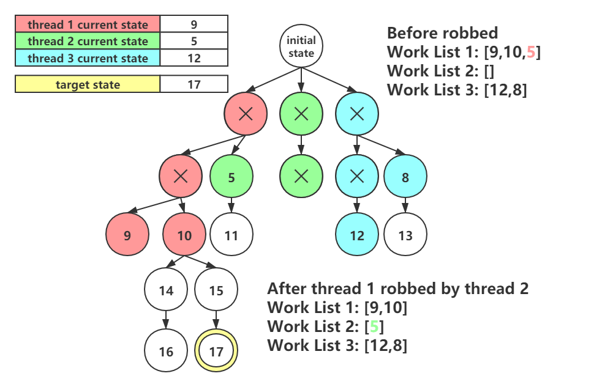
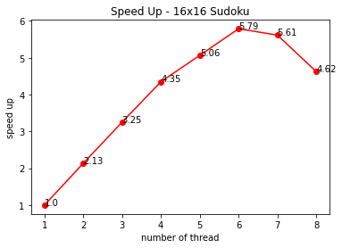

# Parallel Sudoku Solver

In 2020 fall CSCI 596 final project, we build a parallel sudoku solver using OpenMP to parallelize backtracking algorithm on Sudoku. 

## How to Run the Sudoku Sovler

Follow these in the root directory to compile the C file.
```shell
mkdir build
cd build
cmake ..
make
```
Run the sudoku-solver to solve <sudoku-file> puzzle.
```shell
./sudoku-solver <sudoku-file> <number_of_threads>
```

## Meaning of each file

- sudoku.c: the main program of parallel sudoku solver
- list.c: definition and operations of the work list
- list.h: header file for list.c
- CMakeLists.txt: Guide the compiler to automatically generate the makefile stuff


## What is Sudoku
Sudoku is a logic-based number puzzle featuring a 9x9 board divided into rows, columns, and 3x3 square blocks. The goal of the game is to fill each row, column, and block with unique numbers in the range 1 through 9. Variations of sudoku have used larger boards, such as hexadoku: sudoku with a 16x16 board.


### Rules (for standard Sudoku)

1. A standard Sudoku contains 81 cells in a 9 by 9 grid. 

2. Each cell contains a number from 1-9. 

3. Each number can only occur once in each row, column, and 3 by 3 box.

### Commonly Algorithms

1. **Brute Force**: Require a long execution time.
2. **Humanistic Algorithm**: Quick solving method but it may not solve a Sudoku if not applying other methods.
3. **Backtracking**: Performing DFS with pruning strategy, guaranteeing a solution if it exists.

## Parallel DFS

Noticing that order of DFS won't change the solution of Sudoku, we could parallelize our DFS procedure.

### Why Important

DFS and backtracking is a critical and wildly used algorithm in computer science field, it is used almost everywhere.
And some problems are NP-hard which means they are time consuming when the search spaces are huge.
So it's important to parallel the DFS and backtracking procedure to speed up the program.

### Challenges

- How to avoid race conditions when different threads communicate?
- How to make fully use of each thread? Which means how to assign new job to idle thread.

### Our Solution

Initially, each thread starts at a different state and perform single thread searching strategy.

Once a thread is idle (finishing its current work), it tries to find some works from other threads in order to make fully use of each thread.


## How to solve Race Condition

### Race condition on work list

Each thread holds a work list to track its current state and record the remaining work. When one thread finishes its work, it tries to find other works from other threads by examining work lists of other threads.

Work list will be read and changed by different threads when a robbery occurs, which cause a race condition.
 
Work list is designed as an concurrent doubly linked list, and we use openmp_lock to ensure read-after-write consistency.

### Race condition on masks updates

Once robbery occurred, one thread needs to copy masks from another thread. Data consistency must be guaranteed during the copy process. 

Thus, a openmp_lock for each thread's masks is needed.

## Data Structure we used for solving race conditions

**1. Concurrent Doubly Linked List (work list)**

Each thread has it own work list, for saving its unvisited state.
New state will be inserted into the head of the list. 
Other threads will rob the state from the tail, which is close to the search root. So that we can minimize the thread communications.

**2. State Masks and Sudoku board.**

Each thread has a set of state masks and sudoku board for doing DFS and backtracking.  

When robbery happen, the idle thread will copy all the masks and board information of the robbed thread. So that the idle thread can keep searching base on the robbed state.

## An example of parallel DFS traversal





## Experiments and Results

Finally we have done scalability analysis of this sudoku solver. Due to 9 by 9 sudoku is way to fast to be solved, we conduct experiment on 16 by 16 sudoku.

Our sudoku solver achieves linear speedup when thread number is no more than 6, in fact even superlinear speedup on some tests with multiple solutions. The superlinear speedup was possible because with multiple threads, the solver could arrive at one solution faster, and kill all the other threads before they did extra work. 

When the thread number is bigger than 6, the speed up will be tapered off, because the solver was so fast that the overhead of spawning threads outweigh the benefits of parallelization.

**Execution Time for 16x16 Sudoku**


Sudoku solver achieved minimum execution time with 6 threads.

**Speed Up for 16x16 Sudoku**



Speed up is defined as the ratio of single thread runtime to multithread runtime. Sudoku solver achieved best speed up with 6 threads.

**Efficiency for 16x16 Sudoku**


Efficiency is defined as the ratio of speedup to the number of processors. Efficiency measures the fraction of time for which a processor is usefully utilized. We get the best efficiency when using 4 threads.


